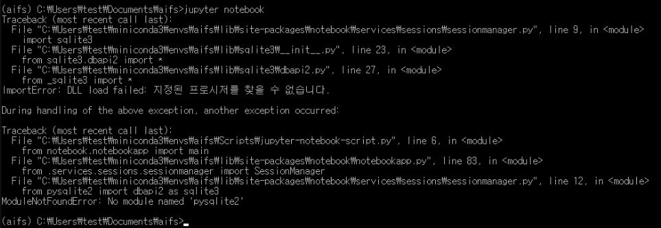
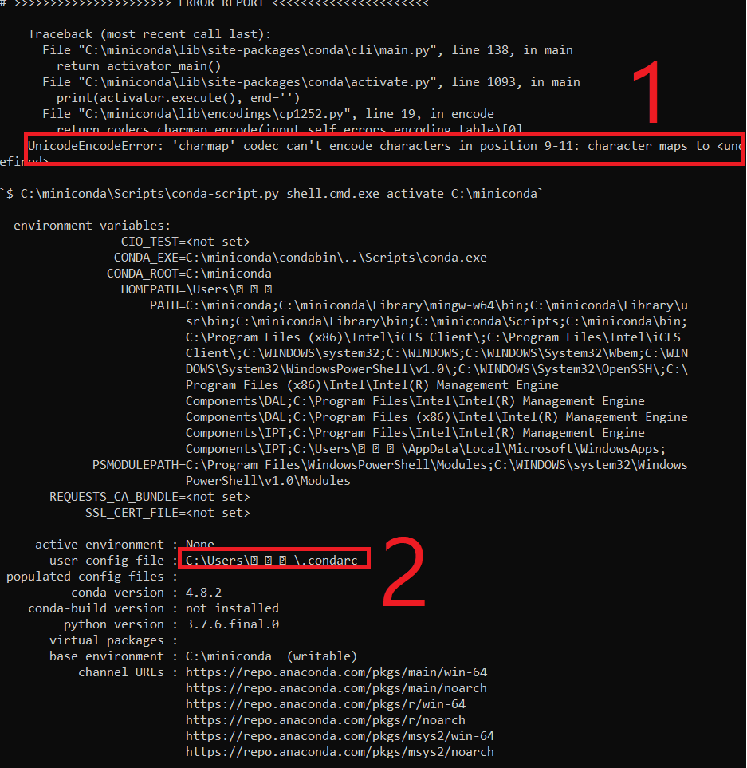

# class-2020-Artificial-Intelligence-and-Future-Society

## 공지

### 온라인 수업의 어려움을 해소하기 위한 HY Smart Class 강좌 신청 안내

온라인으로 수업을 들으시며 어려운 점이 많으리라 생각합니다.
수업만으로 드는 어려움을 해소하고자 인공지능과미래사회를 총괄하시는 기관에서 아래 3강좌를 신청할 수 있도록 하여 공지합니다

* 목적: 온라인 수업의 어려움을 해소하기 위하여 별도의 시스템으로 제공
* 신청 강좌: ICT 리터러시, 놀면서 알아가는 파이선, 소프트웨어와 코딩
* 신청 방법: https://hysc.hanyang.ac.kr/ 에서 포털 아이디와 비번으로 로그인하여 위 강좌 신청

### 코로나19 관련 수업 방식 변경 안내

안녕하세요. 인공지능과 미래사회 강의를 맡은 이웅희입니다. 코로나19 관련 수업 방식 변경에 관한 공지입니다.

코로나 19에 대한 학교 대응 방안의 일환(교육부 권고사항)으로, 모든 학생은 개강 후 첫 2주간 (3월 16일부터) 온라인 강좌 또는 과제 중심 수업을 수강해야 합니다.

온라인 강좌를 위한 동영상은 블랙보드를 통해 제공될 예정이며 강좌 소개 및 교과 내용 일부를 포함합니다.

개강 첫 주와 둘째 주 모두 온라인 이론 강의를 시청하고, 오프라인 강의를 대체할 온라인 실습 강의를 시청해야 합니다.

* 개강 첫 주(3월 16~20일)에는 수강생들은 동영상 강좌를 시청하고, 본인의 컴퓨터에 실습 환경을 설정해야 합니다(윈도우, 맥OS, 리눅스 환경 모두 설정 방법을 온라인 실습 강의에서 제공 예정).
* 둘째 주에(3월 23~27일)는 첫 주에 설치한 실습환경에서 온라인 이론 강의와 연계된 오프라인 대체 실습 강의를 보시고 각자 진행하시면 됩니다.

오프라인을 대체할 두 수업 모두 블랙보드를 통해 제공되므로 해당 영상을 시청 완료하셔야 출석이 인정됩니다.

궁금한 점이 생기면 언제든 제 이메일(woongheelee(at)hanyang(dot)ac(dot)kr)로 연락 바랍니다.

감사합니다.

## 평가항목
* 출석(온라인) : 20%
* 출석(오프라인) : 10%
* 퀴즈 : 10%
* 중간고사 : 30%
* 기말고사 : 30%

## 참고서적

수강생분들께서 파이썬 공부에 도움이 될 만한 책을 세 가지를 고려하여 선정했습니다.

1. 필수적인 내용이 빠짐없이 설명되어있는지?

2. 설명이 쉬운지?

3. 무료인지?

아래 링크를 따라가시면 책을 보실 수 있습니다. 학습에 도움이 되었으면 좋겠습니다. (* 개수는 책 난이도)

1. [점프 투 파이썬](https://wikidocs.net/book/1) (*)

2. [파이썬 코딩 도장](https://dojang.io/course/view.php?id=7) (***)

## Q&A

### Q. 퀴즈 세부 사항에 '5회 시도가 남음' 이라고 나와있는데 무슨 의미인지 궁금합니다.
A. 퀴즈를 다 풀고 제출하면 1번 시도인데요. 문제를 풀 수 있는 기회가 5번 있다는 것입니다. 그 중에서 가장 높은 점수가 성적에 입력됩니다.

### Q. (윈도우 환경) jupyter notebook을 입력하고 enter를 누른 결과 아래 사진과 같이 "ImportError: DLL load failed: 지정된 프로시저를 찾을 수 없습니다." 에러가 출력되고, 웹 브라우저가 실행되지 않습니다.

A. 프로그램 실행에 필요한 DLL 파일이 없어서 생기는 문제로, [링크](https://1drv.ms/u/s!AuS4E8bOdN2BlpR1Svd-tl6JueMG5w?e=XKFJ1k)에 가셔서 윈도우 32비트라면 sqlite-dll-win32-x86-3310100.zip 파일을, 윈도우 64비트라면 sqlite-dll-win64-x64-3310100.zip 파일을 다운로드 받아 압축을 해제합니다.

파일 두 개가 나오는데, 둘 다 C:\Windows\System32 에 파일을 붙여넣고 다시 주피터 노트북을 실행해보시기 바랍니다.

### Q. (윈도우 환경, 한글 이름 사용자) 설치 경로를 영문으로만 해서 설치했으나 콘다가 동작하지 않으며 아래 그림과 같이, UnicodeEncodeError: 'charmap' codec can't encode characters in position ... 에러가 납니다(아래 그림의 1번).

A. 콘다 설치에서 사용자 설정용 파일의 경로(위 그림의 2번)에 한글 때문에 인코딩 에러가 발생 합니다. 영문으로 된 사용자를 추가해서 다시 설치하시면 제대로 동작합니다. (만약 영문으로 된 사용자를 추가하지 않고, 한글 사용자를 그대로 사용하려면, 설치할 때 영문으로만 된 경로에 설치하며, "Just Me" 가 아니라 "All Users" 로 설치하면 된다고 합니다. 요건 정말 그런지 **재확인 필요**)

### Q. eval이라는 함수는 언제 사용되고, 쓰임새가 궁금합니다.

A. eval(expression,[globals[,locals]]) 문법으로 사용합니다. expression 은 실행 가능한 문자열을 입력 받아 이를 실행하도록 합니다. 예를 들어 코드에서 정의해둔 변수를 입력할 수도 있고, 내장함수를 쓸 수도 있습니다. 그러나 시스템 공격에도 사용될 수 있기 때문에 안전한 코딩을 위해서는 되도록 사용을 지양하시면 좋겠습니다. 자세한 예제와 설명은 <u>***[링크](./appendix/appendix_eval.ipynb)***</u>의 보충 설명 노트북을 참고바랍니다.